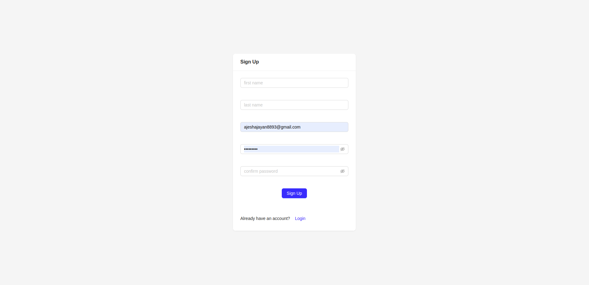
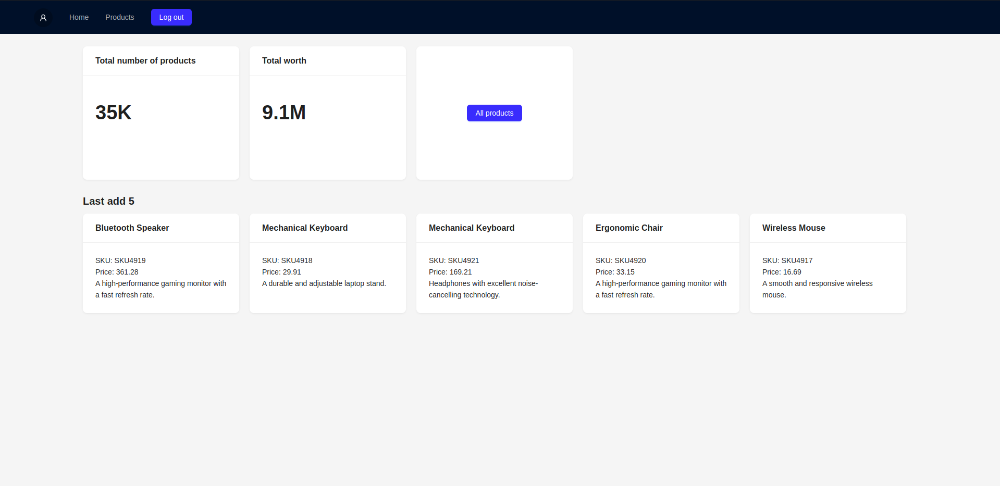
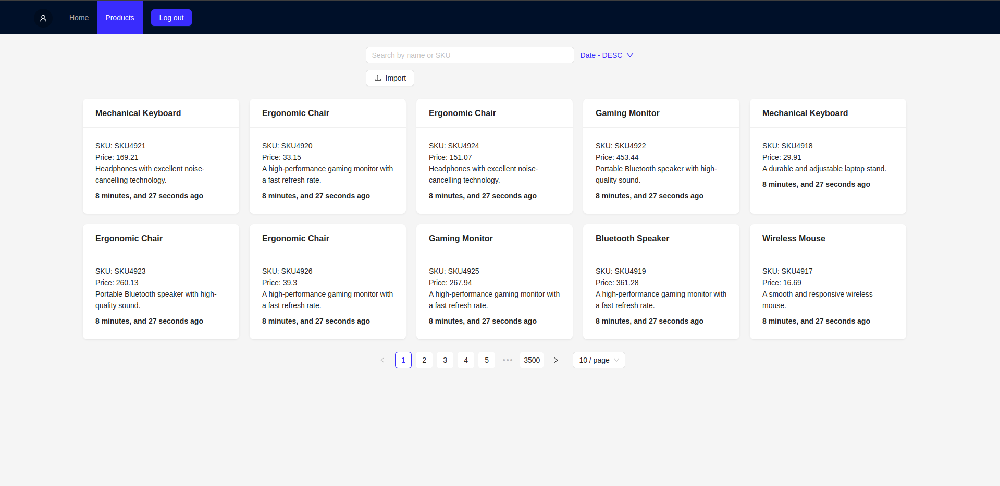

# Machine Test
This is a mono-repo that include both FE and BE; MongoDB is used as database. 


## Runing the project using docker compose

cd to root directory
```bash
  docker compose down -v
  docker compose up --build
```
note: wait for 3-4 minitues for all the serives to be up and running.
## Installing using yarn
```bash
  cd backend
  yarn && yarn dev

  cd frontend
  yarn && yarn dev
```


    
## Environment Variables

.env file are already included in the repo for the sake of simplicity


## Demo
[Watch the Loom video](https://www.loom.com/embed/49725ef4d4da4204ba309347a04129fd?sid=29aa8368-1018-41b5-91a1-f96ecb825d02)


## Screenshots







## Features
* File Upload with Streams: Efficient handling of large file uploads using streams, improving performance and resource management.
* Batch Updates for Data Insertion: Data is inserted in batches with a configurable batch size. A loop is used to process and insert data efficiently, optimizing the import process.
* Search Functionality: Allows searching for products by name and SKU, providing a fast and intuitive way to find specific products.
* Sorting by Name and Price: Products can be sorted by name and price, offering users multiple ways to view the product list.
* Last 5 Products: Easily retrieve and display the last 5 products added to the system for quick access to the most recent items.
* Total Product Count: Track and display the total number of products in the system, offering insights into the overall inventory.
* Total worth of price: Track and display the total price of products in the system, offering insights into the overall inventory.
* Insights Data with Indexes: Utilizes indexes on createdAt and price fields to optimize queries and provide valuable insights into product trends and pricing.
* Calculation of Days Ago: Displays the number of days since products were added, helping users track product age and freshness.

## Optimizations
* Web Worker Threads for Upload Handling in BE: Utilizes web worker threads for file uploads, ensuring the main UI thread remains responsive during the process.
* Web Worker Threads for validation in FE: Utilizes web worker threads for CSV validation, ensuring the main UI thread remains responsive during the process.
* Memory optimazation using stream: Streams are used to handle upload, so that the file has not saved in memory
* Rollback Strategies: Implements rollback strategies to maintain data consistency and integrity in case of any failure during file import or data insertion.
* Efficient Indexing: Indexes are applied on key fields like createdAt and price to speed up searches and improve query performance.
* Product Count in a Separate Collection: The total count and price data are stored in a separate document to optimize performance and reduce query load on the main product collection.
* Debouncing for Search Queries: The search functionality includes debouncing to prevent excessive requests during typing, enhancing performance and reducing server load.

## Validation
* File Size Validation: Validates file sizes on both the frontend and backend to ensure uploaded files meet required size limits, preventing performance degradation.
* File Validation: Ensures only CSV files are uploaded. Non-CSV files are rejected to maintain data integrity and ensure correct processing.
* Email and Password Validation: Enforces proper validation for email and password inputs to meet security and format standards for user authentication.

## What could have done better?
* Compressing and decompressing the CSV files for faster uploading.
* Implement job queue to handle CSV files processing. 
* Make use of job queues to implement retrying the processing of CSV files, on failure.
* Use SSE to notify the client system that uploaded file is processed successfully. Polling is used at the moment.


